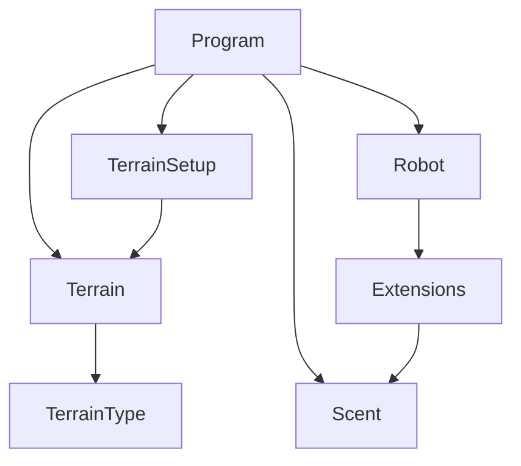
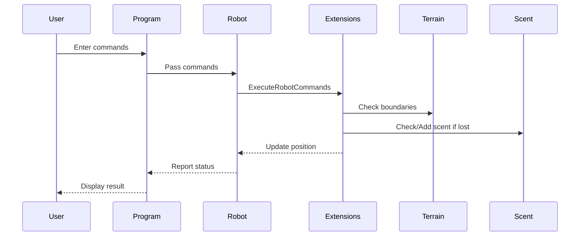

# Martian Robot World

## Overview
This project simulates a robot exploring a grid-based Martian terrain. The robot can be placed on the terrain, receive movement commands, and interact with the environment, including avoiding hazards and leaving a scent when lost.

## Features
- Console-based interface for user input
- Terrain setup with customizable size
- Robot placement and orientation (N, S, E, W)
- Command execution (F: Forward, L: Left, R: Right)
- Scent system to prevent repeated losses at the same location
- Edge detection to prevent the robot from moving off the grid

## Main Components

### 1. Program.cs
- Handles user input and the main application loop
- Manages terrain and robot setup
- Delegates command execution to the robot

### 2. Entities
- **Robot**: Represents the robot's position and orientation
- **Terrain**: Represents each cell in the grid (type: Edge, Sand, etc.)
- **Scent**: Marks locations where robots have been lost
- **TerrainType**: Enum for terrain cell types

### 3. Extensions
- Contains logic for executing robot commands and managing scents

### 4. TerrainSetup
- Static class for creating and displaying the terrain grid

## How It Works
1. **Setup**: User enters the grid size (e.g., `5 3` for 5 columns and 3 rows).
2. **Robot Placement**: User enters the robot's starting position and orientation (e.g., `1 1 E`).
3. **Command Input**: User enters a sequence of commands (e.g., `RFRFRFRF`).
4. **Execution**: The robot moves according to the commands, interacting with the terrain and leaving a scent if lost.

---

## Class Diagram



---

## Sequence Diagram: Robot Command Execution



---

## Example Usage
```
Robot Martian World
5 3
1 1 E
RFRFRFRF
Robot moved to position (1, 1) facing E
```

---

## For Developers
- All business logic is in the `Entities` and `Extensions` folders.
- Tests are in the `MartianRobotConApp.Tests` project.
- The code is structured for clarity and maintainability.

## For Business Personnel
- The simulation models real-world robot navigation and hazard avoidance.
- The scent system prevents repeated losses, simulating learning from past mistakes.
- The project is easily extensible for more complex terrain or robot behaviors.

---

## Running the Project
1. Build the solution:
   ```sh
   dotnet build
   ```
2. Run the application:
   ```sh
   dotnet run --project MartianRobotConApp
   ```
3. Run tests:
   ```sh
   dotnet test
   ```

---

## Contact
For questions or contributions, please contact the project maintainer.
